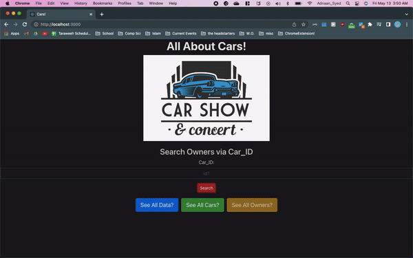

# Lab 5

## Introduction
This is the front-end for the back-end we created in the last lab. I was only able to accomplish displaying GET Requests to my server, and did not have enough time to create POST & PATCH requests. Hopefully I will work on in this in the future and fix that in future iterations.

## Description
Created a full stack application
* Back-End: Node.js & Express.js & SQLite3
* Frond-End: Bootstrap & React.js

## Dependencies (installed by Node)
-   react
- express
- sqlite3

## Content
- The **"client"** folder stores all the front end files in it. The important directory within it is the **"src"** folder, which contains all of my work (other directories are just to create a React app). In the folder contains the **"components"** folder, which contains all my React components for the project. It also contains **"media"** folder, for any images I added to the webpage. It also contains the **"App.js**" file (the root of my React webpage) and **"App.css"** where i did some light styling.
- The "data_lab5" folder stores the **"data.csv"** that was added as a submodule to my project from an external Github repository.
- The **"server"** folder contains all the files related to the backend/API. It contains the **"createDatabase.sql"** file which creates my database **("carContestLab.db")**. It also contains **"database.js"**, which creates my database on the Node server, and finally **"server.js",** which holds the Express server I created from the database. 

## Getting Started

After cloning the project repository, you must  run the Make file, connect to both the backend server, and also the frontend application.

1. To run the make file, just run `` make `` on your terminal.
2. To make connecting to the backend easier, I translocated the files to Lab 5. To connect to the backend, cd into the server folder & run the following code: 

```
npm install 
npm start
```

3. To connect to the frontend, cd into the client folder & run the following code: 

```
npm install 
npm start
```

## KNOWN BUGS
- I was not able to complete the entire project, so only GET Requests are supported by the app, even though I created routes for all CRUD operations.
- When clicking a button to see the requested data, must click it again to close it so you can see the payload of pressing the other buttons. **If you dont click the button twice, and press another button, the payload of the previous request will cover the current one**
- For querying database with a Car_ID to obtain the respective owner, if you input a Car_ID that DNE then no output would be shown. I tried to make it so that an empty table would pop up, but could not figure it out. 
- Thats it, to my knowledge.

## Storyboarding

**Because my website is an SPA, drawing a complex storyboard seemed frivolous. Detailed below is how users would interact with my webpage. I have also included a gif of my SPA**



-   View the entire database: Click the "See All Data" button
-   View the Cars and their info: Click the "See All Cars" button
-   View the Owners and their info: Click the "See All Owners" button
- View an Owner based off their unique Car_ID: Enter a number in the input bar under "Search Owners via Car_ID" => Press Submit
